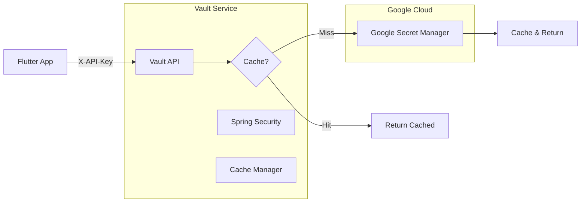

# Marketiniya Vault

Secure proxy service for Firebase secrets from Google Cloud Secret Manager with caching.

## Features

- 🔐 API key authentication
- ☁️ Google Secret Manager integration
- 🚀 In-memory caching
- 🔥 All Firebase secrets in one call

## Architecture



## Project Structure

```
marketiniya-vault/
├── src/
│   ├── main/
│   │   ├── java/com/marketiniya/vault/
│   │   │   ├── MarketiniyaVaultApplication.java
│   │   │   ├── config/
│   │   │   │   ├── CacheConfig.java
│   │   │   │   ├── SecurityConfig.java
│   │   │   │   └── SecretManagerConfig.java
│   │   │   ├── constants/
│   │   │   │   └── SecretNames.java
│   │   │   ├── controller/
│   │   │   │   └── VaultController.java
│   │   │   ├── model/
│   │   │   │   └── SecretsResponse.java
│   │   │   └── service/
│   │   │       ├── SecretService.java
│   │   │       └── impl/
│   │   │           └── GoogleSecretManagerService.java
│   │   └── resources/
│   │       └── application.yml
│   └── test/
│       └── java/com/marketiniya/vault/
│           └── controller/
│               └── VaultControllerTest.java
├── build.gradle
├── settings.gradle
├── gradlew
└── README.md
```

## API Endpoints

### Get All Firebase Secrets (Cached)

Retrieve all Firebase configuration secrets in a single API call with intelligent caching.

```
GET /api/vault/secrets
Headers: X-API-Key: your-api-key
```

### Cache Management

Clear the in-memory cache to force fresh retrieval from Google Secret Manager.

```
POST /api/vault/cache/clear
Headers: X-API-Key: your-api-key
```

**Response:**
```
Cache cleared successfully
```

### Health Check

Public endpoint for monitoring application health.

```
GET /actuator/health
```

**Response:**
```json
{"status":"UP"}
```

## Performance

### Cache Behavior

- **Automatic caching**: All secrets are cached after first retrieval
- **Manual cache clearing**: Use `POST /api/vault/cache/clear` to force refresh
- **Memory efficient**: Uses Spring's ConcurrentMapCacheManager
- **Thread-safe**: Handles concurrent requests safely

## Configuration

### Environment Variables

**⚠️ IMPORTANT: Set these environment variables before running the application:**

```bash

export GOOGLE_CLOUD_PROJECT_ID=your-google-cloud-project-id
export VAULT_API_KEY=your-secure-api-key
```

**Or create a `.env` file (not committed to git):**
```bash

GOOGLE_CLOUD_PROJECT_ID=your-google-cloud-project-id
VAULT_API_KEY=your-secure-api-key
```

## Running the Application

### Prerequisites
- Java 21
- Gradle 8.5+
- Google Cloud credentials configured

### Local Development
```bash

# Set up Google Cloud authentication
gcloud auth application-default login

# Run the application
./gradlew bootRun
```

## Testing

```bash

# Run all tests
./gradlew test

# Build the project
./gradlew build
```

## Security

- API key authentication via `X-API-Key` header
- No secret values in logs
- Secure error responses that don't leak information
- Non-root Docker user

## Monitoring

- Health check endpoint at `/actuator/health`
- Structured logging
- Error tracking and metrics ready
